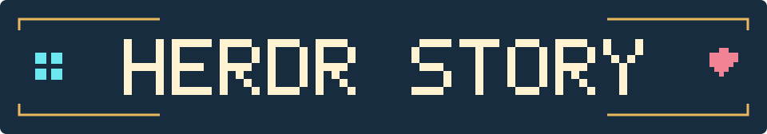
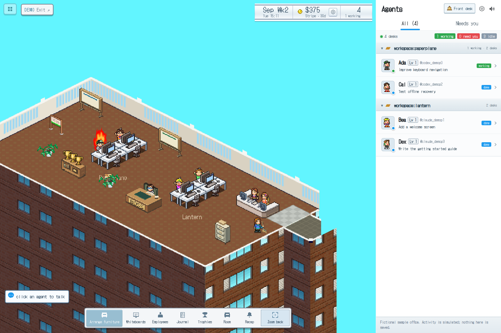
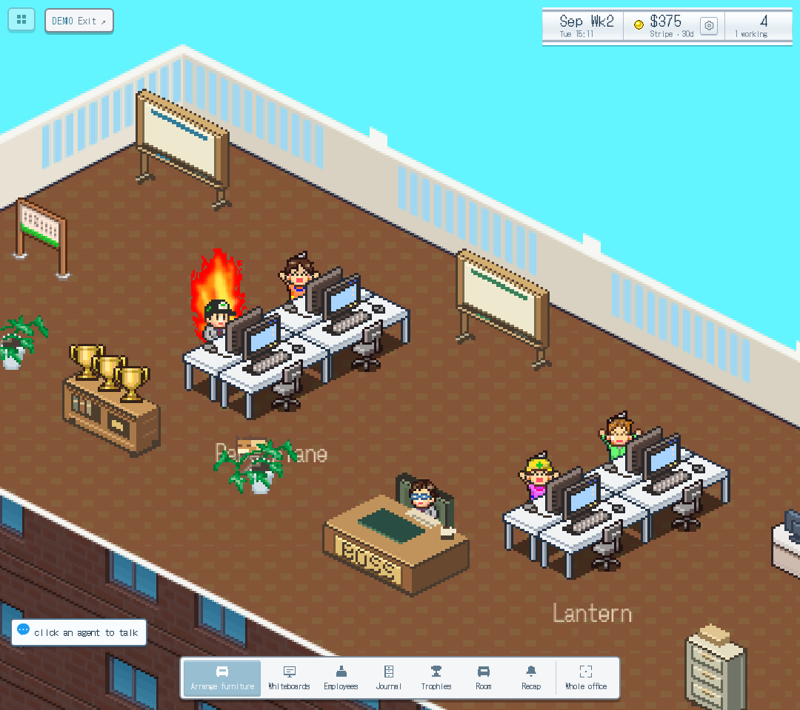
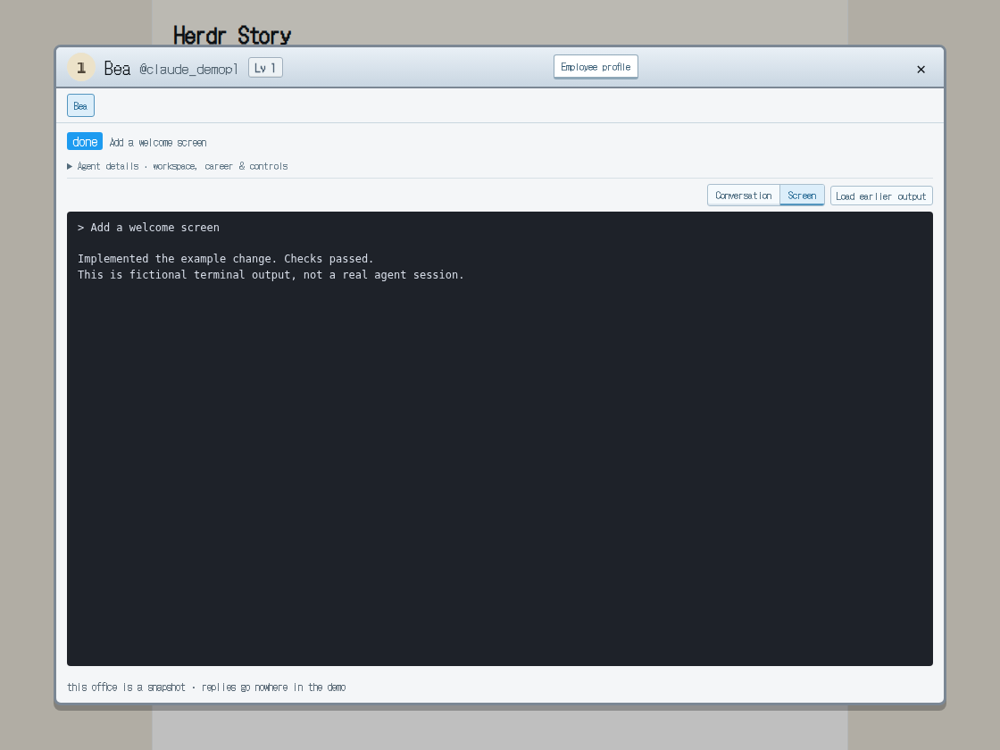
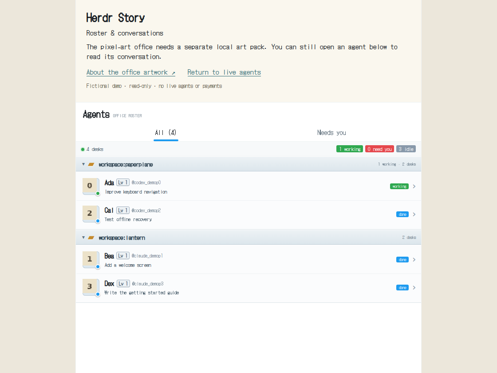
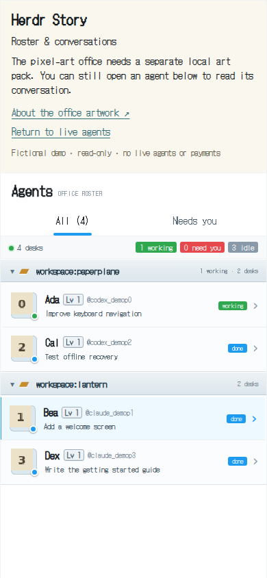
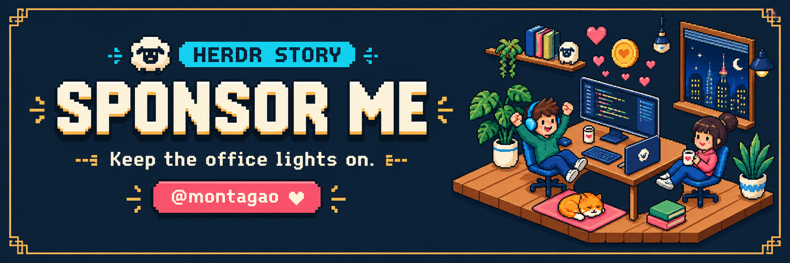

<p align="center">
  
</p>

<h3 align="center">Your coding agents. Their own little game studio.</h3>

<p align="center">
  Watch them work at their desks. Jump into a conversation.<br />
  Come back to a journal of what shipped.
</p>

<p align="center">
  <a href="#get-started">Get started</a> ·
  <a href="#a-small-office-with-a-lot-going-on">Explore the office</a> ·
  <a href="docs/guide.md">User guide</a> ·
  <a href="https://donate.stripe.com/9AQbM3eOZ5q31heeUV">Sponsor me ♥</a>
</p>

<p align="center"><kbd>LOCAL FIRST</kbd> &nbsp; <kbd>CODEX + CLAUDE</kbd> &nbsp; <kbd>BUN + PHASER</kbd> &nbsp; <a href="LICENSE">ISC source license</a> &nbsp; <a href="https://github.com/montagao/herdr-story/actions/workflows/ci.yml"></a></p>



<p align="center"><sub>Actual app, fictional demo data. The full office assets are included in this private repository; <a href="docs/assets.md">artwork credits and public-build details</a>.</sub></p>

Herdr Story turns your [Herdr](https://herdr.dev) agent sessions into a place you can look around.
Codex and Claude get desks. Projects get whiteboards. Finished work becomes studio history.
There’s a boss with ideas, a janitor with a cleanup plan, and a cat you can pet between tasks.

## A small office with a lot going on

| In the office | What you can do |
| --- | --- |
| **Every agent gets a desk** | See who’s working, finished, waiting on you, or rate limited. Open their conversation from the room or roster. |
| **You’re still in charge** | Send prompts and images, queue follow-ups, choose model and effort, or stop a task and recover its last prompt. |
| **The whiteboards remember** | Give projects milestones and checklists. Save releases and completed work in a searchable journal, then mark entries read. |
| **Catch up when you return** | See what shipped while you were away, including recorded payments and a USD revenue estimate. |
| **Make the place yours** | Move desks and plants, change the room theme, rename employees, and watch their careers grow. |
| **Meet the regulars** | Ask Boss for project-scoped ideas, let Gus help review inactive agents, or say hello to Miso the cat. |
| **Read the conversation, not the screen** | An agent’s window shows its own transcript as prose, with the raw pane one click away and a stale veil while it refreshes. |
| **Walk up to the front desk** | Four shortcuts: *Who needs me?*, *I have a new task*, *Catch me up*, and *Find something* across agents, boards, the journal and Boss’s archive. |

Optional **Stripe and RevenueCat** integrations bring payment activity into the office.
The bridge keeps recording while the page is closed, as long as it remains running.

## The office cuts to a scene

Like the game it borrows from, the office cuts away for its big moments. Every scene is earned by
something real in the journal or the event stream, plays in the same pixel window chrome, and is
a click or Escape to dismiss. Idle agents wander and gossip in between; new hires walk in over
the landing, leavers say bye at reception, and a fan or the mascot drops by when a trial starts
or a subscriber signs up.

| Scene | What earns it |
| --- | --- |
| **Ship party** | An agent finishes real work, or money arrives |
| **Weekly sales report** | The calendar rolls into a new week: projects ranked by what they earned or shipped |
| **Awards night** | Employee of the week, or a trophy landing in the journal |
| **Launch day** | A release entry, or a day that beats the best day on record |
| **Crunch time** | Someone has been on one task for 25 minutes; when it ends they drop face-down on the desk |
| **Training seminar** | A model or effort change, or a promotion |
| **GAMEDEX** | Three projects ship in a single day |
| **Bug blowout** | A failed or disputed payment, or a pane that crashed |
| **Boss briefing** | Click the boss desk for product ideas drawn from the journal |
| **Re-org** | Review idle agents, then watch the ones you let go walk out |

Add `?debug` to the URL for a **Test events** tray that fires every payment event, scene and
office gag on demand.

<details>
<summary><b>Take a closer look: agents, terminal output, and mobile</b></summary>

### The team, up close



### Open a conversation

The terminal viewer below uses the read-only demo. Live sessions also have prompt, queue,
model, and stop controls.



### No art pack? Start with the roster.

The art-free view supports existing-agent chat and controls. Room, hiring, studio,
and billing windows currently need the full office. [Artwork details →](docs/assets.md)





</details>

## Get started

You’ll need **Node.js 22.12+**, **npm**, and **Bun 1.3.14+** on Linux or macOS.
Windows is untested; use WSL for the Bash scripts and Unix socket bridge.

```sh
git clone https://github.com/montagao/herdr-story.git
cd herdr-story
npm ci
npm run dev:mock
```

Open **http://127.0.0.1:5173**. Mock mode needs no credentials, paid API calls, or running agents.
For the fictional, read-only demo, open **[/?demo=1](http://127.0.0.1:5173/?demo=1)**.

> **Ready to open the office:** this private repo includes the runtime art and audio, so no
> extraction step is needed after cloning. The Kairosoft assets are separate from the ISC code
> license and are excluded from public builds and source exports. [Asset details →](docs/assets.md)

### Bring your own agents

Install [Herdr](https://herdr.dev), start a session, then run:

```sh
npm run dev             # connect to Herdr with local terminal controls
npm run dev:read-only   # browse without sending prompts or changing the studio
```

The bridge listens on `127.0.0.1:7788`. Set `HERDR_SOCKET_PATH` for a custom Unix socket, or
`HERDR_SESSION` for a named session. Payment sources are optional; `.env.example` lists their settings.

This is an **experimental local tool**. Keep it on your machine or a trusted private tailnet;
read-only mode still exposes private terminal output. [Security and trust model →](SECURITY.md)

<details>
<summary><b>Setup help and the rest of the manual</b></summary>

- **Socket closed / agents missing:** check that Herdr is running and that the configured socket
  belongs to the current session. A persistent disconnect is not expected.
- **Office artwork missing:** see [asset requirements](docs/assets.md); the roster remains available.
- **Payments:** copy `.env.example` to `.env` and uncomment only what you need. Never put secrets in
  `VITE_` variables. [Provider setup, webhooks, and revenue calculations](docs/guide.md).
- **Remote access:** use the [private Tailscale setup](docs/guide.md), not a public game endpoint.
- **Backups, model settings, journals, and room controls:** [read the user guide](docs/guide.md).

</details>

## Keep the office lights on

[](https://donate.stripe.com/9AQbM3eOZ5q31heeUV)

I’m building Herdr Story to make running a bunch of coding agents feel a little more human.
If you’d like to support its development, **[sponsor me →](https://donate.stripe.com/9AQbM3eOZ5q31heeUV)**.
Stars, thoughtful bug reports, and contributions help too.

<sub>One-time donation via Stripe. Defaults to US$2; you can change the amount at checkout.</sub>

## Build something for the studio

Found a rough edge? Have an idea for the office? [Open an issue](https://github.com/montagao/herdr-story/issues)
or read [CONTRIBUTING.md](CONTRIBUTING.md). An independently licensed replacement art pack
would be a particularly welcome contribution.

```sh
npm run check           # types, unit tests, publication checks, and build
npm run build:public    # app build without the local proprietary art pack
npx playwright install chromium
npm run test:release    # isolated browser and bridge-access checks
```

```
 Herdr session ──socket──▶  Bun bridge (bridge/)  ──websocket──▶  Browser (src/)
   agents, panes,            polls agents, reads               Phaser office scene,
   prompts, screens          transcripts, records the          roster, windows,
                             journal and money in SQLite       cutscenes
```

| Directory | What lives there |
| --- | --- |
| [`src/`](src/) | Browser UI, conversations, and the Phaser office |
| [`bridge/`](bridge/) | Bun server, agent connections, and durable studio state |
| [`shared/`](shared/) | Contracts shared by the browser and bridge |

Feature-specific checks are listed in `package.json`. CI uses fictional data and an isolated mock
bridge. [Screenshot capture instructions](docs/screenshots/README.md) · [Artwork provenance](docs/art/README.md)

<details>
<summary><b>Preparing a build or source archive to share</b></summary>

`npm run demo:sample` regenerates the fictional demo. `npm run demo:export` instead captures
**private live data** into ignored `captures/`; it is not an anonymizer.

`npm run release:source` prepares the current source tree without Git history, credentials,
private captures, dependencies, or the local asset pack. The checked-in office screenshots do
show that artwork. Review the [publication checklist](docs/publishing.md) and asset rights
before public distribution; replacing a branch doesn’t erase all historical GitHub content.

</details>

---

Original code: **[ISC](LICENSE)**. Third-party artwork retains its own rights and licenses;
see [notices and credits](THIRD_PARTY_NOTICES.md). The sponsor illustration is promotional art,
not an in-app screenshot. Herdr Story is independent of Kairosoft, Anthropic, OpenAI, Stripe,
and RevenueCat.
